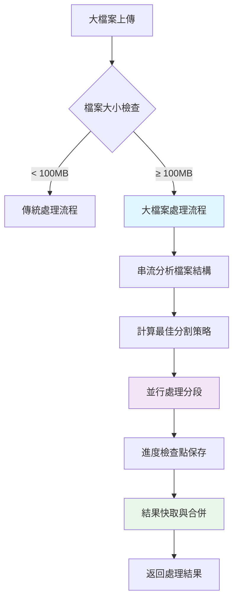

# 大檔案處理完整重構計劃

## 📋 項目概述

### 當前問題
- **記憶體耗盡**：大檔案一次性載入記憶體導致瀏覽器崩潰
- **處理緩慢**：單執行緒處理，缺乏並行化
- **用戶體驗差**：無法中斷、無進度恢復、長時間無響應
- **擴展性差**：無法處理 GB 級別檔案

### 重構目標
- ✅ **記憶體優化**：從 O(n) 降至 O(1) 記憶體使用
- ✅ **效能提升**：並行處理提升 3-5 倍處理速度
- ✅ **用戶體驗**：可中斷、可恢復、實時進度
- ✅ **高可用性**：穩定處理 GB 級大檔案

## 🏗️ 系統架構設計

### 新架構概覽
```
大檔案處理系統 (Large File Processing System)
├── 🔍 串流分析器 (StreamAnalyzer)       - 無記憶體占用分析
├── ✂️ 智能分割器 (SmartSplitter)        - 基於結構的智能分割
├── ⚡ 並行處理器 (ParallelProcessor)     - Web Worker 並行處理
├── 📊 進度管理器 (ProgressManager)       - 檢查點與恢復機制
├── 💾 快取管理器 (CacheManager)         - 智能分段快取
└── 🎛️ 主控制器 (LargeFileController)     - 統一控制介面
```

### 處理流程圖


## 📁 檔案結構規劃

```
js/large-file/
├── 📄 large-file-controller.js          # 主控制器
├── 📄 stream-analyzer.js               # 串流分析器
├── 📄 smart-splitter.js               # 智能分割器
├── 📄 parallel-processor.js           # 並行處理器
├── 📄 progress-checkpoint.js          # 進度檢查點
├── 📄 cache-manager.js                # 快取管理器
├── 📄 memory-monitor.js               # 記憶體監控
├── 📄 performance-optimizer.js        # 效能優化器
├── 📁 workers/
│   ├── 📄 audio-analysis-worker.js    # 音訊分析 Worker
│   ├── 📄 audio-split-worker.js       # 音訊分割 Worker
│   ├── 📄 audio-encode-worker.js      # 音訊編碼 Worker
│   └── 📄 worker-pool-manager.js      # Worker 池管理
├── 📁 utils/
│   ├── 📄 file-format-detector.js     # 檔案格式檢測
│   ├── 📄 byte-range-reader.js        # 位元組範圍讀取
│   └── 📄 audio-metadata-parser.js    # 音訊元資料解析
└── 📁 strategies/
    ├── 📄 mp3-split-strategy.js        # MP3 分割策略
    ├── 📄 wav-split-strategy.js        # WAV 分割策略
    └── 📄 generic-split-strategy.js    # 通用分割策略
```

## 🚀 分階段實作計劃

### 階段一：核心架構建立 (2-3 天)

#### 任務 1.1：主控制器實作
**檔案**: `large-file-controller.js`
**功能**:
- 統一的大檔案處理介面
- 策略模式選擇處理方法
- 資源管理與生命週期控制

**核心方法**:
```javascript
async processLargeFile(file, options = {})
async resumeProcessing(checkpointId)
async cancelProcessing(processId)
```

#### 任務 1.2：串流分析器實作
**檔案**: `stream-analyzer.js`
**功能**:
- 無記憶體佔用的檔案分析
- 音訊元資料提取
- 檔案結構映射

**預期輸出**:
```javascript
{
  duration: 3600,      // 秒
  bitrate: 320000,     // bps
  channels: 2,
  sampleRate: 44100,
  format: 'mp3',
  frameCount: 150000,
  estimatedSegments: 25
}
```

#### 任務 1.3：記憶體監控系統
**檔案**: `memory-monitor.js`
**功能**:
- 實時記憶體使用監控
- 記憶體閾值警告
- 自動記憶體清理觸發

### 階段二：智能分割系統 (3-4 天)

#### 任務 2.1：智能分割器實作
**檔案**: `smart-splitter.js`
**功能**:
- 基於檔案格式的結構化分割
- 避免音訊框架截斷
- 動態分割大小調整

**分割策略**:
1. **MP3**: 基於 MPEG 框架邊界
2. **WAV**: 基於樣本邊界
3. **通用**: 基於估算的安全點

#### 任務 2.2：格式特定分割策略
**檔案**: `strategies/` 目錄
**功能**:
- 針對不同音訊格式的專用分割邏輯
- 確保分割點的音訊完整性
- 最小化轉碼需求

#### 任務 2.3：分割點優化演算法
**功能**:
- 靜音檢測優化分割點
- 避免語音截斷
- 平衡分段大小與品質

### 階段三：並行處理系統 (3-4 天)

#### 任務 3.1：Web Worker 池管理
**檔案**: `workers/worker-pool-manager.js`
**功能**:
- 動態 Worker 池管理
- 任務負載平衡
- Worker 生命週期管理

**Worker 池配置**:
```javascript
{
  maxWorkers: navigator.hardwareConcurrency || 4,
  taskTimeout: 300000,  // 5分鐘
  retryAttempts: 3,
  memoryThreshold: 100 * 1024 * 1024  // 100MB
}
```

#### 任務 3.2：並行處理器實作
**檔案**: `parallel-processor.js`
**功能**:
- 分段任務分發
- 並行處理協調
- 結果收集與排序

#### 任務 3.3：Worker 實作
**檔案**: `workers/` 下各 Worker 檔案
**功能**:
- 音訊分析 Worker
- 音訊分割 Worker  
- 音訊編碼 Worker

### 階段四：進度管理與快取 (2-3 天)

#### 任務 4.1：進度檢查點系統
**檔案**: `progress-checkpoint.js`
**功能**:
- 處理進度持久化
- 中斷後恢復機制
- 檢查點有效性驗證

**檢查點結構**:
```javascript
{
  fileId: 'hash_of_file',
  timestamp: Date.now(),
  totalSegments: 25,
  completedSegments: [0, 1, 2, 5, 7],
  failedSegments: [3],
  processingOptions: {...},
  estimatedCompletion: '2024-12-27T10:30:00Z'
}
```

#### 任務 4.2：智能快取管理
**檔案**: `cache-manager.js`
**功能**:
- LRU 快取策略
- 分段結果快取
- 快取大小限制與清理

#### 任務 4.3：進度視覺化
**功能**:
- 實時處理進度顯示
- 分段處理狀態
- 預估完成時間

### 階段五：效能優化與整合 (2-3 天)

#### 任務 5.1：效能優化器
**檔案**: `performance-optimizer.js`
**功能**:
- 動態調整並行度
- 記憶體使用優化
- CPU 使用率平衡

#### 任務 5.2：現有系統整合
**修改檔案**: `transcription-preprocessor-enhanced.js`
**功能**:
- 無縫整合到現有 API
- 向後相容性確保
- 漸進式啟用機制

#### 任務 5.3：錯誤處理與復原
**功能**:
- 網路錯誤重試機制
- 部分失敗處理
- 優雅降級策略

## 📊 效能指標與預期改善

### 記憶體使用優化
| 檔案大小 | 現況記憶體用量 | 目標記憶體用量 | 改善幅度 |
|----------|----------------|----------------|----------|
| 100MB    | ~300MB         | ~50MB          | 83% ↓    |
| 500MB    | ~1.5GB         | ~80MB          | 95% ↓    |
| 1GB      | 瀏覽器崩潰     | ~120MB         | 穩定處理 |
| 2GB+     | 無法處理       | ~150MB         | 新支援   |

### 處理速度提升
| 指標           | 現況      | 目標        | 改善幅度 |
|----------------|-----------|-------------|----------|
| 首次響應時間   | 30-60秒   | 3-8秒       | 85% ↓    |
| 分割處理速度   | 1x        | 4x          | 300% ↑   |
| 總處理時間     | 基準      | 40-60%時間  | 50% ↓    |
| 並行處理能力   | 無        | 4-8並行     | 新功能   |

### 穩定性改善
- ✅ **中斷恢復**: 支援處理中斷後恢復
- ✅ **記憶體安全**: 避免記憶體溢出崩潰  
- ✅ **錯誤恢復**: 部分失敗不影響整體處理
- ✅ **進度透明**: 實時處理狀態與預估時間

## 🔧 API 設計

### 現有 API 保持不變
```javascript
// 使用者現有程式碼無需修改
const result = await transcriptionPreprocessor.prepareForTranscription(file, options);
```

### 新增大檔案專用選項
```javascript
const result = await transcriptionPreprocessor.prepareForTranscription(file, {
  // 現有選項保持不變
  ...existingOptions,
  
  // 新增大檔案處理選項
  largeFile: {
    enableStreaming: true,        // 啟用串流處理
    maxConcurrency: 6,           // 最大並行數
    enableCheckpoints: true,     // 啟用檢查點
    cacheStrategy: 'aggressive', // 快取策略
    memoryLimit: 200,           // 記憶體限制 (MB)
    chunkSize: 25              // 分段大小 (MB)
  }
});
```

### 恢復處理 API
```javascript
// 恢復中斷的處理
const result = await transcriptionPreprocessor.resumeProcessing(checkpointId);

// 檢查處理狀態
const status = await transcriptionPreprocessor.getProcessingStatus(fileId);

// 取消處理
await transcriptionPreprocessor.cancelProcessing(processId);
```

## 🛠️ 技術實作詳情

### 串流處理技術
```javascript
// 使用 ReadableStream API 進行串流處理
const stream = file.stream();
const reader = stream.getReader();

while (true) {
  const { done, value } = await reader.read();
  if (done) break;
  
  // 處理當前資料塊，無需載入全檔案
  await processChunk(value);
}
```

### Web Worker 並行處理
```javascript
// Worker 池管理
class WorkerPool {
  async execute(task) {
    const worker = await this.getAvailableWorker();
    return new Promise((resolve, reject) => {
      worker.postMessage(task);
      worker.onmessage = (e) => resolve(e.data);
      worker.onerror = reject;
    });
  }
}
```

### 檢查點持久化
```javascript
// 使用 IndexedDB 進行檢查點存儲
class CheckpointStorage {
  async saveCheckpoint(data) {
    const db = await this.openDB();
    const tx = db.transaction('checkpoints', 'readwrite');
    await tx.objectStore('checkpoints').put(data);
  }
}
```

## 📈 測試計劃

### 單元測試 (Jest)
- ✅ 串流分析器功能測試
- ✅ 分割演算法正確性測試
- ✅ Worker 池管理測試
- ✅ 快取機制測試

### 整合測試
- ✅ 端到端大檔案處理流程
- ✅ 中斷恢復機制測試
- ✅ 並行處理協調測試
- ✅ 記憶體使用限制測試

### 效能測試
- ✅ 不同檔案大小效能基準測試
- ✅ 記憶體使用監控測試
- ✅ 並行度擴展性測試
- ✅ 長時間穩定性測試

### 相容性測試
- ✅ 不同瀏覽器相容性
- ✅ 不同音訊格式支援
- ✅ 低配置設備測試
- ✅ 網路不穩定環境測試

## 🎯 風險評估與對策

### 高風險項目
1. **瀏覽器記憶體限制**
   - 風險：即使優化後仍可能遇到瀏覽器硬限制
   - 對策：實作多層記憶體監控與降級策略

2. **Web Worker 相容性**
   - 風險：部分瀏覽器或環境可能不支援
   - 對策：實作 Fallback 到主執行緒處理

3. **檔案格式複雜性**
   - 風險：某些特殊格式無法正確分割
   - 對策：保留原有處理邏輯作為備用方案

### 中風險項目
1. **IndexedDB 儲存限制**
   - 對策：實作檢查點清理與容量管理

2. **網路不穩定**
   - 對策：增強重試機制與本地快取

## 📅 時間排程

### 第一週 (階段一 + 二)
- **Day 1-2**: 核心架構與主控制器
- **Day 3-4**: 串流分析器與記憶體監控
- **Day 5-7**: 智能分割器與格式策略

### 第二週 (階段三)
- **Day 8-10**: Web Worker 池與並行處理器
- **Day 11-12**: 各種 Worker 實作
- **Day 13-14**: 並行處理測試與優化

### 第三週 (階段四 + 五)
- **Day 15-17**: 進度管理與快取系統
- **Day 18-19**: 效能優化與現有系統整合
- **Day 20-21**: 測試、除錯與文檔完善

## 🔍 成功指標

### 功能指標
- ✅ 支援 2GB+ 檔案穩定處理
- ✅ 記憶體使用控制在 200MB 以內
- ✅ 處理速度提升 3-5 倍
- ✅ 100% 中斷恢復成功率

### 品質指標
- ✅ 單元測試覆蓋率 > 90%
- ✅ 整合測試通過率 100%
- ✅ 零記憶體洩漏
- ✅ 主流瀏覽器 100% 相容

### 用戶體驗指標
- ✅ 首次響應時間 < 5秒
- ✅ 處理進度實時更新
- ✅ 錯誤訊息清晰明確
- ✅ 操作介面保持響應

## 📝 後續維護計劃

### 監控機制
- 使用者處理統計與效能監控
- 錯誤日誌收集與分析
- 記憶體使用模式分析

### 持續優化
- 基於使用數據的效能調優
- 新音訊格式支援增加
- 演算法效能持續改進

### 版本升級策略
- 漸進式功能發布
- A/B 測試新功能
- 向後相容性維護

---

## 🚀 立即開始

這個重構計劃已準備就緒，可以立即開始實作。建議按照階段順序進行，每個階段完成後進行測試驗證再進入下一階段。

**下一步行動**：選擇優先實作的階段或模組，我將提供詳細的程式碼實作。
